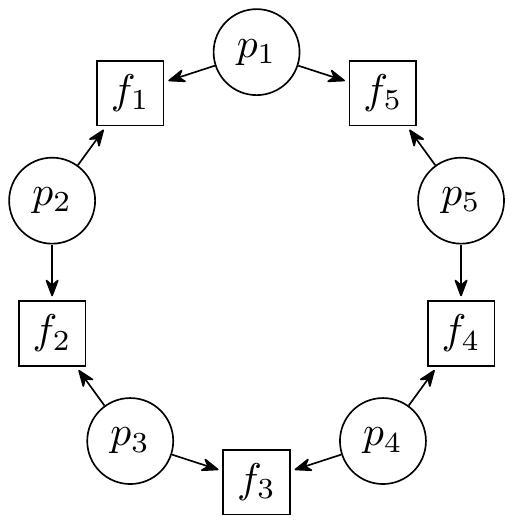
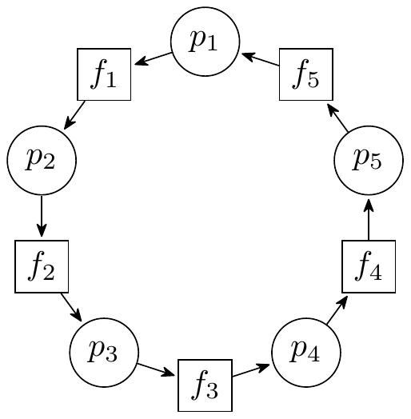

## Dining philosophers

### Zadatak

Proces je pokrenuo 5 niti koje simuliraju ponašanje filozofa za stolom. Filozof neko vreme misli, uzima levu i desnu viljušku na stolu, jede ručak na tanjiru, vraća viljuške, i nastavlja da misli. Filozof ne može da uzme levu viljušku ukoliko ju je trenutno filozof levo koristi, i slično ne može da uzme desnu viljušku ukoliko ju je trenutno filozof desno koristi. Ukoliko svih pet filozofa u isto vreme pokušaju da uzmu levu viljušku, ni jedan filozof neće moći da uzme desnu viljušku, i tada nastupa deadlock. Implementirati ponašanje filozofa pomoću semafora tako da se ovaj deadlock ne može dogoditi.

**Šta je graf alokacije resursa?**

Graf alokacije resursa (eng. Resource allocation graph (RAG)) je usmeren graf u kome čvorovi predstavljaju niti ili resurse, a grane povezuju niti i resurse. Ukoliko je grana usmerena od čvora niti ka čvoru resursa (nit → resurs), data nit može u nekom trenutku zauzeti taj resurs. Ukoliko je nit usmerena od čvora resursa ka čvoru niti (nit ← resurs), data nit je zauzela resurs i trenutno ga drži. Ukoliko se u grafu pojavi **petlja**, nastaje deadlock.
Primer grafa alokacije resursa:





### 1. način

Možemo obrnuti redosled uzimanja viljušaka jednog filozofa (ili parnih filozofa) i time otkloniti mogućnost pojave petlje u grafu alokacije resursa.

```cpp
#include <thread.h>
#include <sem.h>
#define N 5
Sem forks[N] = { 1, 1, 1, 1, 1 };
void phil(int id) {
    int right = (id + 1) % N;
    int left = (id == 0) ? (N - 1) : (id - 1); // alternative: `int left = id;`
    while (true) {
        // Think
        think();
        // Acquire forks
        if (id % 2 == 0) { // alternative: `if (id == 0)`
            wait(forks[left]);
            wait(forks[right]);
        } else {
            wait(forks[right]);
            wait(forks[left]);
        }
        // Eat
        eat();
        // Release forks 
        signal(forks[left]);
        signal(forks[right]);
    }
}
int main() {
    Thread tp[N];
    for (int i = 0; i < N; i++) 
        tp[i] = createThread(phil, i);
    for (int i = 0; i < N; i++) 
        join(tp[i]);
    return 0;
}
```

### 2. način

Možemo napraviti uposleno čekanje i zauzeti viljuške kada postanu slobodne (**Napomena:** Uposleno čekanje je neefikasno i kada su na raspolaganju semafori, obično je loše praviti uposleno čekanje ukoliko ono nije neophodno)

```cpp
#include <thread.h>
#include <sem.h>
#define N 5
Sem mutex = 1;
bool avail[] = { true, true, true, true, true };

void phil(int id) {
    int right = (id + 1) % N;
    int left = (id == 0) ? (N - 1) : (id - 1);
    while (true) {
        // Think
        think();
		// Acquire forks
		while (true) {
            wait(mutex);
            if (avail[left] && avail[right])  {
                avail[left] = false;
                avail[right] = false;
                signal(mutex);
                break;
            } else {
                signal(mutex);
                usleep(50);
            }
        }
        // Eat
        eat();
		// Release forks
		wait(mutex);
        avail[left] = true;
        avail[right] = true;
        signal(mutex);
    }
}
int main() {
    Thread tp[N];
    for (int i = 0; i < N; i++) 
        tp[i] = createThread(phil, i);
    for (int i = 0; i < N; i++) 
        join(tp[i]);
    return 0;
}
```

### 3. način

Možemo imati semafor `ticket`  inicijalizovan na vrednost $N - 1$, ukoliko je $N$ broj filozofa. Tako poslednji filozof ne može da zahteva viljuške ukoliko $N-1$ filozofa pre zahtevalo viljške, pa se ne može javiti petlja.

```cpp
#include <thread.h>
#include <sem.h>
#define N 5

Sem sFork[N] = { 1, 1, 1, 1, 1 };
Sem ticket = 4;

int phil(int id) 
{
    int left = id;
    int right = (id + 1) % N;
    while (true) {
        // Think
		think();
		// Acquire forks
        wait(ticket);
        wait(sFork[left]);
        wait(sFork[right]);
        // Eat
		eat();
		// Release forks
        signal(sFork[left]);
        signal(sFork[right]);
        signal(ticket);
    }
}
int main() {
    Thread tp[N];
    for (int i = 0; i < N; i++)
        tp[i] = createThread(phil, i);
    for (int i = 0; i < N; i++)
        join(tp[i]);
    return 0;
}
```

### 4. način

Možemo koristiti privatne semafore filozofa na koji će se filozof blokirati ukoliko ne može da uzme viljuške. Filozof mora da najavi da nije uspeo da uzme viljuške (preko `hungry[]`) kako bi filozof koji oslobađa viljuške znao da li treba da pokuša da deblokira filozofa levo ili desno pored sebe.

```cpp
#include <thread.h>
#include <sem.h>
#define N 5
#define LEFT(id) (((id) + 1) %  N)
#define RIGHT(id) (((id) == 0) ? (N - 1) : ((id) - 1))
#define CAN_EAT(id) (available[LEFT(id)] && available[RIGHT(id)])
Sem mutex = 1;
Sem privs[] = { 0, 0, 0, 0, 0 };
bool available[] = { true, true, true, true, true };
bool hungry[] = { false, false, false, false, false };

void phil(int id) 
{
    int left = LEFT(id);
    int right = RIGHT(id);
    while (true) {
        // Think
        think();
        // Acquire forks
        wait(mutex);
        if (! CAN_EAT(id)) {
            hungry[id] = true;
            signal(mutex);
            wait(privs[id]);
        }
        hungry[id] = false;
        available[left] = false;
        available[right] = false;
        signal(mutex);
        // Eat
        eat();
        // Release forks
        wait(mutex);
        available[left] = true;
        available[right] = true;
        if (hungry[left] && CAN_EAT(left)) {
            signal(privs[left]);
        } else if (hungry[right] && CAN_EAT(right)) {
            signal(privs[right]);
        } else {
            signal(mutex);
        }
    }
}
int main() {
    Thread tp[N];
    for (int i = 0; i < N; i++) 
        tp[i] = createThread(phil, i);
    for (int i = 0; i < N; i++) 
        join(tp[i]);
    return 0;
}
```
